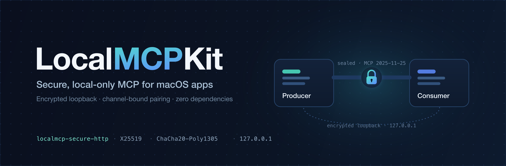
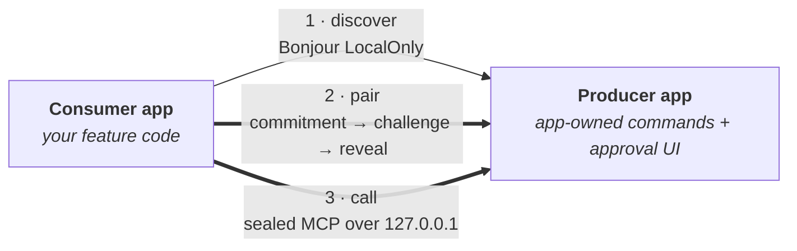

<p align="center">
  
</p>

<p align="center">
  <a href="https://github.com/stevemurr/local-mcp-kit/actions/workflows/ci.yml"></a>
  
  
  
  
</p>

<p align="center">
  <b>Expose app-owned commands from one macOS app and discover, pair with, and call them from another —
  over an encrypted loopback channel that never leaves the machine and is never plaintext.</b>
</p>

---

## Overview

**LocalMCPKit** lets a running macOS app publish typed, schema-validated commands as a
[Model Context Protocol](https://modelcontextprotocol.io) endpoint, and lets another app on the
same Mac discover it, pair with explicit user approval, and call those commands.

It runs the full **MCP 2025-11-25** lifecycle — `initialize`, `notifications/initialized`,
`tools/list`, `tools/call`, sessions, and cancellation — but carries every message inside a
**LocalMCP encrypted loopback envelope** (`localmcp-secure-http`). The bearer token, session and
protocol headers, and the JSON-RPC body never appear on the outer wire, and the endpoint is bound
to numeric `127.0.0.1` only. It is not generic plaintext Streamable HTTP.

The package is transport-neutral at its core with production macOS backends, and ships with
**zero external dependencies**.

## Highlights

- **Encrypted by construction** — X25519 key agreement, HKDF-SHA256, and ChaCha20-Poly1305 seal every request and response. The producer's channel key is per-process and destroyed on stop.
- **Channel-bound pairing** — a commitment → challenge → reveal exchange binds the grant to the exact producer instance and key, with a matching human verification code shown in both apps.
- **Loopback-only, LocalOnly** — the listener binds only `127.0.0.1`; Bonjour registration, browsing, and resolution are restricted to `kDNSServiceInterfaceIndexLocalOnly`. Nothing leaves the Mac.
- **Discovery is availability, not trust** — a saved grant is never sent automatically to a replacement producer instance; re-pairing is always explicit.
- **Typed commands** — register `Codable` inputs and outputs validated against a bounded JSON Schema subset before your handler ever runs.
- **Hardened runtime** — per-request authentication, header/body/session/handler limits, replay windows, deadlines, cooperative cancellation, and a no-oracle authorization surface.
- **Keychain-backed grants** — producers store only token digests; consumers hold their own bearer. Items are device-only and non-synchronizing.
- **Testable to the metal** — deterministic in-memory transports, stores, clocks, and randomness, plus an adversarial security suite covering tamper, replay, response-swap, key-substitution, and rotation failures.

## How it works



1. **Discover** — the consumer browses LocalOnly Bonjour and fetches a bounded descriptor. Every advertised field is treated as untrusted until pairing.
2. **Pair** — a channel-bound exchange produces a shared transcript; both apps display the same eight-character code, and the producer's user explicitly approves. Approval issues a per-installation bearer, bound to the producer instance and its channel key.
3. **Call** — the consumer runs the MCP lifecycle and invokes commands, each sealed to the producer's process key and replay-protected.

## Requirements

- macOS 13 or newer
- Swift tools and language mode **6.0** or newer
- XcodeGen and [Tart](https://tart.run) only if you build or VM-test the SwiftUI example through its Xcode project

## Installation

Add LocalMCPKit to your `Package.swift` and depend on the products you need:

```swift
.package(
    url: "https://github.com/stevemurr/local-mcp-kit.git",
    revision: "f5bb74f39b106f31d86870282a9d488b9219ce01" // pin to a reviewed commit
),
```

```swift
.target(name: "MyApp", dependencies: [
    .product(name: "LocalMCPProducer", package: "local-mcp-kit"),
    .product(name: "LocalMCPDiscoveryBonjour", package: "local-mcp-kit"),
    // consumers add: LocalMCPConsumer, LocalMCPDiscovery
])
```

> Tagged semantic-version releases are not published yet — pin to a specific revision for reproducibility.

## Quick start

**Producer** — publish a command and start advertising:

```swift
import LocalMCPProducer
import LocalMCPDiscoveryBonjour

let producer = LocalMCPProducer(
    identity: ProducerIdentity(stableID: "com.example.notes", displayName: "Notes", version: "1.0.0"),
    transport: LocalMCPHTTPProducerTransport(),
    advertiser: BonjourLocalMCPDiscovery(),
    grantStore: try KeychainProducerGrantStore(),
    approval: approvalController // presents the verification code, returns .approve / .deny
)

try await producer.register(searchDefinition) { (input: SearchInput, context) in
    try context.checkCancellation()
    return try .structured(SearchOutput(matches: search(input.query)), text: "…")
}

try await producer.start()
```

**Consumer** — pair once, then run the lifecycle and call:

```swift
import LocalMCPConsumer

let consumer = LocalMCPConsumer(
    instance: discoveredInstance,           // from BonjourLocalMCPDiscovery
    identity: consumerIdentity,
    connector: LocalMCPHTTPConnector(),
    grantStore: try KeychainConsumerGrantStore()
)

let grant = try await consumer.pair { code in show(code) }   // user confirms the same code in both apps
_ = try await consumer.initialize(grant: grant)
let tools = try await consumer.listTools()

let result: SearchOutput = try await consumer.call(
    "notes.search",
    input: SearchInput(query: "quarterly"),
    as: SearchOutput.self
)

await consumer.close() // cancels work and terminates the cached session
```

See the [integration guide](Docs/integration.md) for command schemas, lifecycle ownership, approval UI, entitlements, and troubleshooting.

## Package products

| Product | Responsibility |
| --- | --- |
| `LocalMCPContracts` | Wire-neutral values: identities, commands, grants, channel binding, and service protocols. |
| `LocalMCPDiscovery` | Replaying add/update/remove discovery state, independent of any backend. |
| `LocalMCPDiscoveryBonjour` | Real DNS-SD registration, browsing, resolution, TXT handling, and bounded descriptor loading — all `kDNSServiceInterfaceIndexLocalOnly`. |
| `LocalMCPProducer` | Typed command hosting, schema validation, secure HTTP transport, pairing, authorization, cancellation, deadlines, Keychain grants, and lifecycle. |
| `LocalMCPConsumer` | Secure HTTP connector, explicit pairing, Keychain grants, and the negotiated client lifecycle with bounded per-operation deadlines. |
| `LocalMCPTesting` | Deterministic in-memory transports, stores, discovery, approvers, clocks, and random sources. |
| `local-mcp` | Read-only discovery and descriptor diagnostic CLI. |

`LocalMCPMCPAdapter` is internal — it implements exactly the ratified MCP 2025-11-25 lifecycle and is not a public product, so no wire or networking type appears in the public API.

## Security model

- The listener binds only numeric `127.0.0.1`; there is no public bind-host option.
- The exact numeric `Host` is required and every present `Origin` is rejected.
- Every MCP request authenticates a live, unrevoked grant **before** command dispatch, inside the decrypted envelope.
- Pairing is explicit, producer-owned, short-lived, rate- and concurrency-limited, and channel-bound; each consumer installation gets a distinct grant.
- Network responses use a uniform unauthorized result for missing, wrong, expired, rotated, and revoked tokens, so they never become a grant-status oracle.
- Producer Keychain records hold only token digests; consumer records hold their own bearer. Items are device-only and non-synchronizing.
- Tokens, nonces, verification codes, command payloads, and filesystem data never appear in discovery, descriptors, logs, or diagnostic bundles.

Read [the security model](Docs/security.md) before embedding a producer.

## Examples & CLI

- [`Examples/TwoProducers`](Examples/TwoProducers/README.md) — a SwiftUI app with one consumer, independent Greeter and Calculator producers, and isolated grants, over in-memory boundaries for easy inspection.
- [`Examples/SeparateProcess`](Examples/SeparateProcess/README.md) — a real HTTP/Bonjour producer and consumer as separate processes completing the authenticated MCP lifecycle.
- `local-mcp discover [--timeout SECONDS] [--json]` — observe untrusted LocalOnly advertisements.
- `local-mcp inspect-descriptor <PATH|-> [--json]` — validate a bounded descriptor document.

The CLI is intentionally read-only: it never pairs, reads a grant, lists tools, or invokes commands.

## Testing

```sh
swift build
swift build -c release
swift test
```

The suite covers contracts and JSON fidelity, schema assertions, producer/consumer lifecycle races,
secure-envelope tamper/replay/response-swap/key-substitution adversaries, HTTP framing and security
policy, MCP sessions and cancellation, Bonjour TXT/descriptor/LocalOnly behavior, pairing and
Keychain boundaries, the read-only CLI, and separate-process operation. The macOS UI tests run only
in the repository's Tart VM workflow:

```sh
Scripts/run-ui-tests.sh
```

## Documentation

- [Integration guide](Docs/integration.md) — schemas, lifecycle ownership, approval UI, entitlements, troubleshooting
- [Architecture](Docs/architecture.md) — module boundaries and request flow
- [Security model](Docs/security.md) — threat model, invariants, and request-processing order
- [Local discovery V1 specification](Spec/local-discovery-v1.md) — the normative discovery, pairing, and secure-envelope profile
- [Implementation handoff and evidence checklist](HANDOFF.md)

## License

This repository does not yet select a software license, so default copyright applies (all rights
reserved). Obtain permission appropriate to your use until a license is added.
